## Fast Neural Style Transfer (feed-forward method) :zap::computer: + :art: = :heart:
This repo contains a concise PyTorch implementation of the original feed-forward NST paper (:link: [Johnson et al.](https://arxiv.org/pdf/1603.08155.pdf)).

Checkout my implementation of the original NST (optimization method) paper ([Gatys et al.](https://github.com/gordicaleksa/pytorch-neural-style-transfer)).

It's an accompanying repo for [this video series on YouTube](https://www.youtube.com/watch?v=S78LQebx6jo&list=PLBoQnSflObcmbfshq9oNs41vODgXG-608).

<p align="left">
<a href="https://www.youtube.com/watch?v=S78LQebx6jo" target="_blank"></a>
</p>

### Why yet another Fast NST (feed-forward method) repo?
It's the **cleanest and most concise** NST repo that I know of + it's written in **PyTorch!** :heart:

My idea :bulb: is to make the code so simple and well commented, that you can use it as a **first step on your NST learning journey** before any other blog, course, book or research paper. :books:

I've included automatic, pretrained models and MS COCO dataset, download script - so you can either **instantaneously run it** and get the results (:art: stylized images) using pretrained models **or start training/experimenting with your own models**. :rocket:

## Examples

Here are some examples with the [4 pretrained models](https://www.dropbox.com/s/fb39gscd1b42px1/pretrained_models.zip?dl=0) (automatic download enabled - look at [usage section](#usage)):

<p align="center">

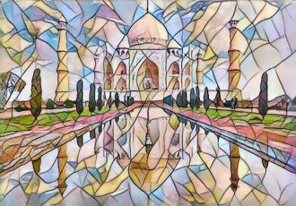
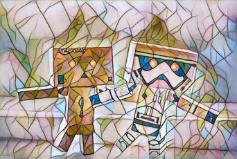


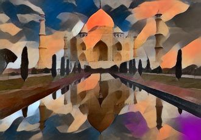


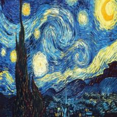
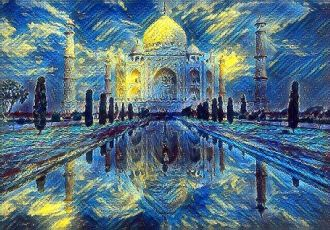


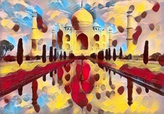

</p>

*Note:* keep in mind that I still need to improve these models, 3 of these (last 3 rows) only saw 33k images from MS COCO.

## Setup

1. Open Anaconda Prompt and navigate into project directory `cd path_to_repo`
2. Run `conda env create` from project directory (this will create a brand new conda environment).
3. Run `activate pytorch-nst-fast` (if you want to run scripts from your console otherwise set the interpreter in your IDE)

That's it! It should work out-of-the-box executing environment.yml file which deals with dependencies.

-----

PyTorch package will pull some version of CUDA with it, but it is highly recommended that you install system-wide CUDA beforehand, mostly because of GPU drivers. I also recommend using Miniconda installer as a way to get conda on your system. 

Follow through points 1 and 2 of [this setup](https://github.com/Petlja/PSIML/blob/master/docs/MachineSetup.md) and use the most up-to-date versions of Miniconda and CUDA/cuDNN (I recommend CUDA 10.1 or 10.2 as those are compatible with PyTorch 1.5, which is used in this repo, and newest compatible cuDNN).

## Usage

Go through this section to run the project but if you are still having problems take a look at [this (stylization)](https://www.youtube.com/watch?v=lOR-LncQlk8&list=PLBoQnSflObcmbfshq9oNs41vODgXG-608&index=5) and [this (training)](https://www.youtube.com/watch?v=EuXd-aO77A0&list=PLBoQnSflObcmbfshq9oNs41vODgXG-608&index=6) accompanying YouTube videos.

### Stylization

1. Download pretrained models, run: `python utils/resource_downloader.py`
2. Run `python stylization_script.py` (it's got default content image and model set)

That's it! If you want more flexibility (and I guess you do) there's a couple more nuggets of info.

More expressive command is:<br/>
`python stylization_script.py --content_input <imgname or directory> --img_width <width> --model_name <name>`

If you pass a directory into `--content_input` it will perform batch stylization.<br/>
You can control the batch size (in case you have VRAM problems) with `batch_size` param.

-----

You just need to specify the **names**, the repo automatically finds content images and models in default directories:
1. content images default dir: `/data/content-images/`
2. model binaries default dir: `/models/binaries/`

So all **you** got to do is place images and models there and you can use them. Output will be dumped to `/data/output-images/`.

After you run resource_downloader.py script binaries dir will be pre-populated with 4 pretrained models.

Go ahead, play with it and make some art!

<p align="center">
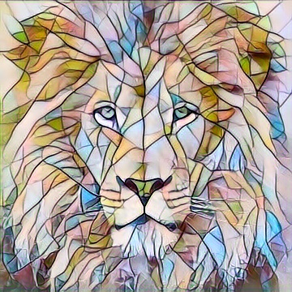
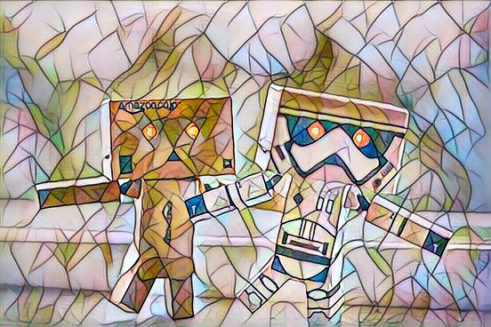
</p>

### Training your own models

1. Download MS COCO dataset, run `python utils/resource_downloader.py -r mscoco_dataset` (it's a 12.5 GB file)
2. Run `python training_script.py --style_img_name <name>`

Now that will probably actually work!

It will periodically dump checkpoint models to `/models/checkpoints/` and the final model to `/models/binaries/` by default.

I strongly recommend playing with these 2 params:
1. **style_weight** - I always kept it in the [1e5, 9e5] range, you may have to tweak it for your specific style image a little bit
2. **subset_size** - Usually 32k images do the job (that's 8k batches) - you'll need to monitor **tensorboard** to figure out if your curves are saturating at that point or not. If they are still going down set the number higher

That brings us to the next section!

### Tensorboard Visualizations

To **start tensorboard** just run: `tensorboard --logdir=runs --samples_per_plugin images=50` from your conda console.

`samples_per_plugin images=<number>` sets the number of images you'll be able to see when moving the image slider.

There's basically **2 things you want to monitor** during your training (not counting console output <- redundant if you use tensor board)

#### Monitor your loss/statistics curves

You want to keep `content-loss` and `style-loss` going down or at least one of them (style loss usually saturates first). 

I usually set tv weight to 0 so that's why you see 0 on the `tv-loss` curve. You should use it only if you see that your images are having smoothness problem ([check this out](https://github.com/gordicaleksa/pytorch-neural-style-transfer#impact-of-total-variation-tv-loss) for visualization of what exactly tv weight does).

<p align="center">
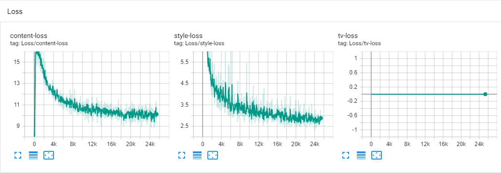
</p>

Statistics curves let me understand how the stylized image coming out of the transformer net behaves. 

<p align="center">
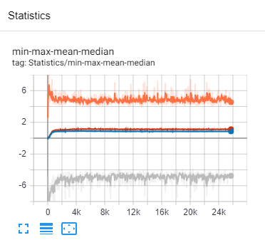
</p>

If max or min intensities start diverging or mean/median start going to far away from 0 that's a good indicator that your (probably) style weight is not good. You can keep the content weight constant and just tweak the style weight.

#### Monitor your intermediate stylized images

This one helps immensely so as to help you manually early-stop your training if you don't like the stylized output you see.

<p align="center">
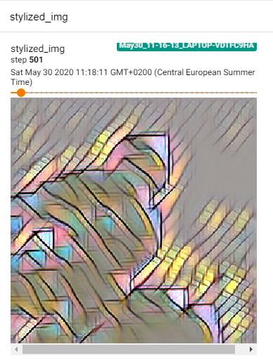
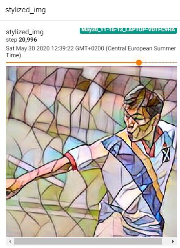
</p>

In the beggining stylized images look kinda rubish like the one one the left. As the training progresses you'll get more meaningful images popping out (the one on the right). 

## Debugging
Q: My style/content loss curves just spiked in the middle of training?<br/>
A: 2 options: a) rerun the training (optimizer got into a bad state) b) if that doesn't work lower your style weight

<p align="left">
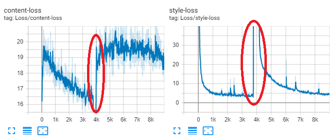
</p>

Q: How can I see the exact parameters that you used to train your models?<br/>
A: Just run the model in the `stylization_script.py`, training metadata will be printed out to the output console.

## Further experimentation (advanced, for researchers)

There's a couple of things you could experiment with (assuming fixed net architectures), here are some ideas:
1. Try and set MSE to `sum` reduction for the style loss. I used that method [here](https://github.com/gordicaleksa/pytorch-neural-style-transfer/blob/master/neural_style_transfer.py) and it gave nice results. You'll have to play with style-weight afterwards to get it running. This will effectively give bigger weight to deeper style representations because Gram matrices coming out from deeper layers are bigger. Meaning you'll give advantage to high-level style features (broad spatial characteristics of the style) over low level style features (smaller neighborhood characteristics like fine brush-strokes).
2. Original paper used `tanh activation` at the output - figure out how you can get it to work using that, you may have to add some scaling. There is this magic constant 150 that Johnson originally used to scale tanh. I created [this issue](https://github.com/jcjohnson/fast-neural-style/issues/186) as it is un-clear of how it came to be and whether it was just experimentally figured out.
3. PyTorch VGG16 pretrained model was trained on the 0..1 range ImageNet normalized images. Try and work with 0..255 range ImageNet mean-only-normalized images - that will also work! It worked [here](https://github.com/gordicaleksa/pytorch-neural-style-transfer/blob/master/utils/utils.py) and if you try and feed such an image into VGG16 (as a classifier) it will give you correct predictions!
4. [This repo](https://github.com/pytorch/examples/tree/master/fast_neural_style) used 0..255 images (no normalization) as an input to transformer net - play with that. You'll have to normalize transformer net output before feeding that to VGG16.

Some of these may further improve the visual quality that you get from these models! If you find something interesting I'd like to hear from you!

## Acknowledgements

I found these repos useful: (while developing this one)
* [fast_neural_style](https://github.com/pytorch/examples/tree/master/fast_neural_style) (PyTorch, feed-forward method)
* [pytorch-neural-style-transfer](https://github.com/gordicaleksa/pytorch-neural-style-transfer) (PyTorch, optimization method)
* [original J.Johnson's repo](https://github.com/jcjohnson/fast-neural-style) (Torch, written in Lua)

I found some of the content/style images I was using here:
* [style/artistic images](https://www.rawpixel.com/board/537381/vincent-van-gogh-free-original-public-domain-paintings?sort=curated&mode=shop&page=1)
* [awesome figures pic](https://www.pexels.com/photo/action-android-device-electronics-595804/)

Other images are now already classics in the NST world.

## Citation

If you find this code useful for your research, please cite the following:

```
@misc{Gordić2020nst-fast,
  author = {Gordić, Aleksa},
  title = {pytorch-nst-feedforward},
  year = {2020},
  publisher = {GitHub},
  journal = {GitHub repository},
  howpublished = {\url{https://github.com/gordicaleksa/pytorch-nst-feedforward}},
}
```

## Connect with me

If you'd love to have some more AI-related content in your life :nerd_face:, consider:
* Subscribing to my YouTube channel [The AI Epiphany](https://www.youtube.com/c/TheAiEpiphany) :bell:
* Follow me on [LinkedIn](https://www.linkedin.com/in/aleksagordic/) and [Twitter](https://twitter.com/gordic_aleksa) :bulb:
* Follow me on [Medium](https://gordicaleksa.medium.com/) :books: :heart:

## Licence

[](https://github.com/gordicaleksa/pytorch-nst-feedforward/blob/master/LICENCE)